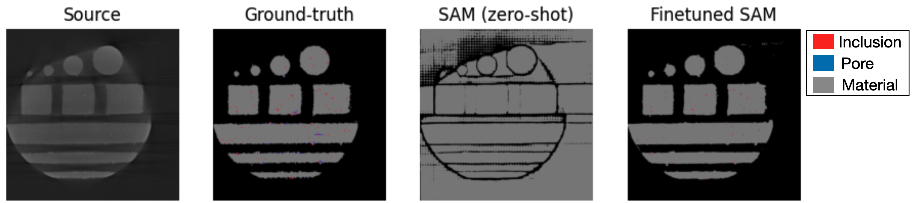
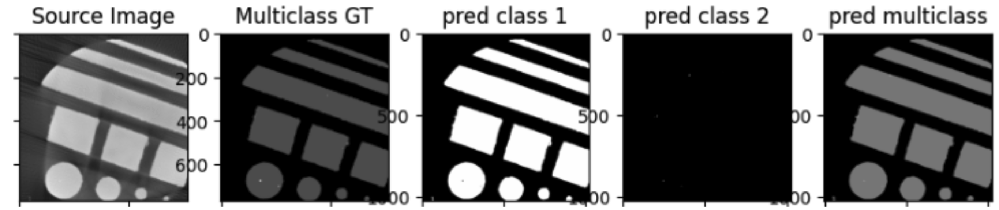
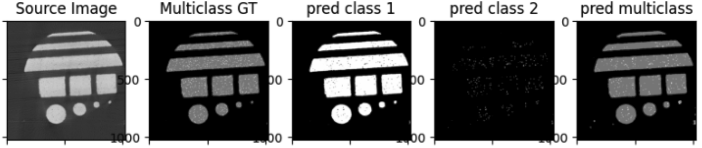
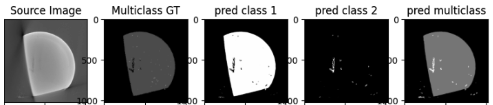
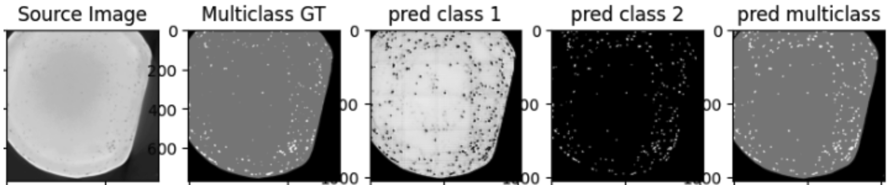
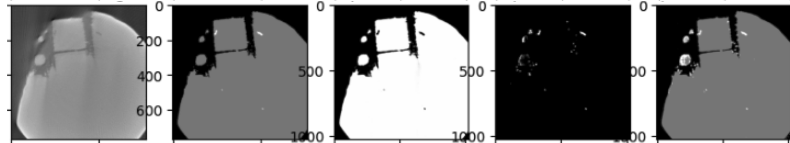

## We modify the code originally created by: https://github.com/autogluon/autogluon/tree/master/examples/automm/Conv-LoRA

# Conv-Lora git repo and install environments: 
	- https://github.com/autogluon/autogluon/tree/master/examples/automm/Conv-LoRA
	- follow the instructions in the above repository to install the necessary libraries and the environment
	
 ```
	conda create -n conv-lora python=3.10
  	conda activate conv-lora
  	pip install -U pip
  	pip install -U setuptools wheel
  	git clone https://github.com/autogluon/autogluon
  	cd autogluon && pip install -e multimodal/[tests]
```
	- Copy following python scripts to autogluon/examples/automm/Conv-LoRA/: 
		- preprocess-scripts/* 
		- run_segmentation.py 
	- for training: we preprocess each file into seperate class and hence train 3 models for 3 seperate class
	- for test: we use the pretrained model for the corresponding class

# Dataset Size:
	- Tr1: 5724
	- Tr2: 1142
	- Te-1: 920
	- Te-2: 920
	- Te-3: 5000
	- Te-4: 1080
	- Te-5: 600
	- Te-6: 785

# Model Training:

```
cd autogluon/examples/automm/Conv-LoRA/
```

## Train each class (1, 2, 3)
```
python run_semantic_segmentation.py --task gan-generated --dataset_dir ./sam-gan/datasets --output_dir ./sam-gan/output/output_class1 --ckpt_path AutogluonModels --data_name train_class1 --num_gpus 3 --batch_size 4 --rank 2
```

	## args:
		- task : gan-generated
		- dataset_dir: main directory of dataset and the location of the .csv data list 
		- output_dir: output directory
		- ckpt_path: where to save model (default directory: AuthogluoModels)
		- data_name: .csv file of data script in datasets/, e.g., train_class1, train_class2, train_class3 (for test use the test1_class1,... test6_class1)
		- num_gpus
		- batch_size
		- rank: rank of Lora

# Test (class1- class3):
	-for each test:
		-- ckpt_path : we need to use the ckpt for the corresponding class saved in AutogluonModels/
		-- output_dir: for seperate class
		-- data_name: 

## class 1 (test1-test6)
```
python run_semantic_segmentation.py --task gan-generated --dataset_dir ./sam-gan/datasets --output_dir ./sam-gan/class1/test1 --ckpt_path AutogluonModels/ag-20240826_214753 --data_name test1_class1 --num_gpus 3 --batch_size 4 --rank 2 --eval
```


## class 2 (test1-test6)
```
python run_semantic_segmentation.py --task gan-generated --dataset_dir ./sam-gan/datasets --output_dir ./sam-gan/class2/test1 --ckpt_path AutogluonModels/ag-20240828_143435/epoch=13-step=24038.ckpt --data_name test1_class2 --num_gpus 3 --batch_size 4 --rank 2 --eval
```

## class 3 (test1-test6)
```
python run_semantic_segmentation.py --task gan-generated --dataset_dir ./sam-gan/datasets --output_dir /./sam-gan/class3/test1 --ckpt_path AutogluonModels/ag-20240905_025905 --data_name test1_class3 --num_gpus 3 --batch_size 4 --rank 2 --eval
```
 
## Plot Prediction images and calculate score for each class
 ```
 python calc_result.py
 ```
 -- fix prediction model name
 -- output name

## Plot and output Multiclass Predicted inages 
```
python plot_multiclass_pred --test_id 1 --hist_match
```
	-- test_id: change the test value as test data id
	-- hist_match: only keep if using histogram matching input (in the repository we only supplied historgram matched inputs, so it can be kept False)

## Sample Results











